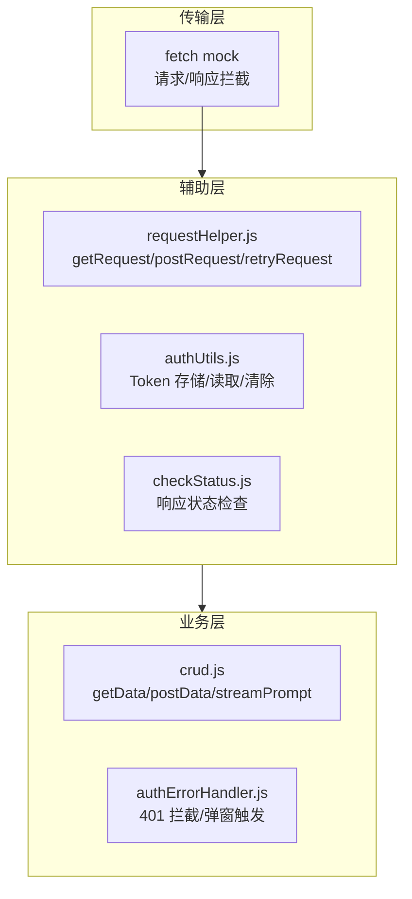

# 场景-2: API 接口测试

> **场景 ID**: yiweb-auto-test-suite-scene-2
> **关联 FP**: FP2
> **优先级**: P0

## §0 测试架构

### 测试目标

验证 YiWeb API 层的请求封装、认证头注入、401 拦截、CRUD 操作的正确性。

### 架构图



### 测试策略

| 模块 | 测试类型 | Mock 策略 | 文件路径 |
|------|:-------:|----------|---------|
| authUtils.js | 单元 | mock localStorage | `src/core/services/helper/authUtils.js` |
| checkStatus.js | 单元 | 直接调用 | `src/core/services/helper/checkStatus.js` |
| requestHelper.js | 单元+集成 | mock fetch | `src/core/services/helper/requestHelper.js` |
| crud.js | 集成 | mock requestHelper | `src/core/services/modules/crud.js` |
| authErrorHandler.js | 单元 | mock 401 响应 | `src/core/services/helper/authErrorHandler.js` |

### 覆盖率目标

- 请求工具行覆盖率 ≥ 80%
- 认证模块分支覆盖率 ≥ 90%

## §1 可执行测试用例

### 模块-1: 认证工具 (authUtils.js)

```javascript
// tests/scene-2-auth.test.js
import { describe, it, expect, beforeEach, vi } from 'vitest';

describe('认证工具 (authUtils.js)', () => {
  let storage;

  beforeEach(() => {
    storage = {};
    vi.stubGlobal('localStorage', {
      getItem: vi.fn((k) => storage[k] ?? null),
      setItem: vi.fn((k, v) => { storage[k] = v; }),
      removeItem: vi.fn((k) => { delete storage[k]; }),
    });
  });

  afterEach(() => {
    vi.unstubAllGlobals();
  });

  it('getStoredToken 从 localStorage 读取 token', async () => {
    storage['X-Token'] = 'test-token-123';
    const { getStoredToken } = await import('/src/core/services/helper/authUtils.js?v=1');
    expect(getStoredToken()).toBe('test-token-123');
  });

  it('saveToken 将 token 写入 localStorage', async () => {
    const { saveToken, getStoredToken } = await import('/src/core/services/helper/authUtils.js?v=1');
    saveToken('new-token');
    expect(storage['X-Token']).toBe('new-token');
  });

  it('getAuthHeaders 返回含 X-Token 的 headers 对象', async () => {
    storage['X-Token'] = 'auth-headers-test';
    const { getAuthHeaders } = await import('/src/core/services/helper/authUtils.js?v=1');
    const headers = getAuthHeaders();
    expect(headers).toHaveProperty('X-Token');
    expect(headers['X-Token']).toBe('auth-headers-test');
  });

  it('clearToken 从 localStorage 移除 token', async () => {
    storage['X-Token'] = 'to-be-cleared';
    const { clearToken, getStoredToken } = await import('/src/core/services/helper/authUtils.js?v=1');
    clearToken();
    expect(getStoredToken()).toBeNull();
  });

  it('hasValidToken 对有效 token 返回 true', async () => {
    storage['X-Token'] = 'valid-token';
    const { hasValidToken } = await import('/src/core/services/helper/authUtils.js?v=1');
    expect(hasValidToken()).toBe(true);
  });

  it('hasValidToken 对空 token 返回 false', async () => {
    delete storage['X-Token'];
    const { hasValidToken } = await import('/src/core/services/helper/authUtils.js?v=1');
    expect(hasValidToken()).toBe(false);
  });
});
```

### 模块-2: 响应检查 (checkStatus.js)

```javascript
// tests/scene-2-checkStatus.test.js
import { describe, it, expect } from 'vitest';

describe('响应检查 (checkStatus.js)', () => {
  it('isJsonResponse 对 application/json 返回 true', () => {
    // 导入后测试
    const contentType = 'application/json; charset=utf-8';
    expect(contentType.includes('application/json')).toBe(true);
  });

  it('isJsonResponse 对 text/html 返回 false', () => {
    const contentType = 'text/html';
    expect(contentType.includes('application/json')).toBe(false);
  });
});
```

### 模块-3: 请求辅助 (requestHelper.js)

```javascript
// tests/scene-2-requestHelper.test.js
import { describe, it, expect, beforeEach, afterEach, vi } from 'vitest';

describe('请求辅助 (requestHelper.js)', () => {
  let fetchSpy;

  beforeEach(() => {
    // Mock 全局函数
    vi.stubGlobal('logInfo', vi.fn());
    vi.stubGlobal('logError', vi.fn());
    vi.stubGlobal('logWarn', vi.fn());
    vi.stubGlobal('timeStart', vi.fn());
    vi.stubGlobal('timeEnd', vi.fn());

    fetchSpy = vi.fn(() =>
      Promise.resolve({
        ok: true,
        status: 200,
        headers: new Map([['content-type', 'application/json']]),
        json: () => Promise.resolve({ code: 0, data: { id: 1 } }),
        text: () => Promise.resolve(JSON.stringify({ code: 0, data: { i: 1 } })),
      })
    );
    vi.stubGlobal('fetch', fetchSpy);
  });

  afterEach(() => {
    vi.unstubAllGlobals();
  });

  it('getRequest 发送 GET 请求', async () => {
    const { getRequest } = await import('/src/core/services/helper/requestHelper.js');
    const res = await getRequest('https://api.effiy.cn/test');
    expect(res.code).toBe(0);
    expect(fetchSpy).toHaveBeenCalled();
  });

  it('postRequest 发送 POST 请求并携带 JSON body', async () => {
    const { postRequest } = await import('/src/core/services/helper/requestHelper.js');
    const res = await postRequest('https://api.effiy.cn/test', { name: 'test' });
    expect(res.code).toBe(0);
    const callArgs = fetchSpy.mock.calls[0];
    expect(callArgs[1].method).toBe('POST');
  });

  it('请求配置包含 credentials: omit', async () => {
    const { getRequest } = await import('/src/core/services/helper/requestHelper.js');
    await getRequest('https://api.effiy.cn/test');
    const callArgs = fetchSpy.mock.calls[0];
    expect(callArgs[1].credentials).toBe('omit');
  });

  it('retryRequest 失败时自动重试', async () => {
    let callCount = 0;
    vi.stubGlobal('fetch', vi.fn(() => {
      callCount++;
      if (callCount < 3) {
        return Promise.reject(new Error('网络错误'));
      }
      return Promise.resolve({
        ok: true,
        status: 200,
        headers: new Map([['content-type', 'application/json']]),
        json: () => Promise.resolve({ code: 0, data: 'recovered' }),
      });
    }));
    const { retryRequest } = await import('/src/core/services/helper/requestHelper.js');
    const res = await retryRequest('https://api.effiy.cn/test', { retries: 3 });
    expect(callCount).toBe(3);
    expect(res.code).toBe(0);
  });
});
```
