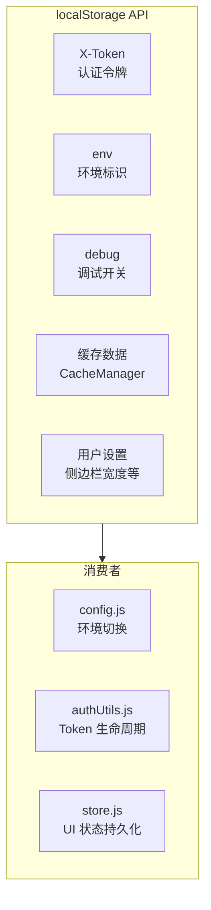

# 场景-3: 数据持久化测试

> **场景 ID**: yiweb-auto-test-suite-scene-3
> **关联 FP**: FP3
> **优先级**: P1

## §0 测试架构

### 测试目标

验证 YiWeb 客户端持久化层的正确性：localStorage Token/环境/调试配置的读写、缓存管理、存储边界处理。

### 架构图



### 测试策略

| 模块 | 测试类型 | Mock 策略 | 文件路径 |
|------|:-------:|----------|---------|
| authUtils.js (持久化) | 单元 | mock localStorage | `src/core/services/helper/authUtils.js` |
| config.js (持久化) | 单元 | mock localStorage + location | `src/core/config.js` |
| cachedRequest | 单元 | mock localStorage + fetch | `src/core/services/helper/requestHelper.js` |
| store UI 持久化 | 集成 | mock localStorage | `src/views/aicr/hooks/store.js` |

### 覆盖率目标

- Token 持久化行覆盖率 ≥ 90%
- 缓存管理分支覆盖率 ≥ 75%

## §1 可执行测试用例

### 模块-1: Token 持久化

```javascript
// tests/scene-3-token-persistence.test.js
import { describe, it, expect, beforeEach, vi } from 'vitest';

describe('Token 持久化', () => {
  let storage;

  beforeEach(() => {
    storage = {};
    vi.stubGlobal('localStorage', {
      getItem: vi.fn((k) => storage[k] ?? null),
      setItem: vi.fn((k, v) => { storage[k] = v; }),
      removeItem: vi.fn((k) => { delete storage[k]; }),
    });
  });

  afterEach(() => {
    vi.unstubAllGlobals();
  });

  it('saveToken 持久化后 getStoredToken 可读取', async () => {
    const { saveToken, getStoredToken } = await import('/src/core/services/helper/authUtils.js?v=1');
    saveToken('persist-test-token');
    expect(getStoredToken()).toBe('persist-test-token');
  });

  it('clearToken 后 getStoredToken 返回 null', async () => {
    const { saveToken, clearToken, getStoredToken } = await import('/src/core/services/helper/authUtils.js?v=1');
    saveToken('temp-token');
    clearToken();
    expect(getStoredToken()).toBeNull();
  });

  it('hasValidToken 对空字符串返回 false', async () => {
    storage['X-Token'] = '';
    const { hasValidToken } = await import('/src/core/services/helper/authUtils.js?v=1');
    expect(hasValidToken()).toBe(false);
  });

  it('hasValidToken 对 null/undefined 返回 false', async () => {
    delete storage['X-Token'];
    const { hasValidToken } = await import('/src/core/services/helper/authUtils.js?v=1');
    expect(hasValidToken()).toBe(false);
  });
});
```

### 模块-2: 环境配置持久化

```javascript
// tests/scene-3-env-persistence.test.js
import { describe, it, expect, beforeEach, afterEach, vi } from 'vitest';

describe('环境配置持久化', () => {
  let storage;

  beforeEach(() => {
    storage = {};
    vi.stubGlobal('localStorage', {
      getItem: vi.fn((k) => storage[k] ?? null),
      setItem: vi.fn((k, v) => { storage[k] = v; }),
    });
  });

  afterEach(() => {
    vi.unstubAllGlobals();
  });

  it('config 读取 localStorage 中的 env 配置', async () => {
    storage['env'] = 'local';
    const { default: config } = await import('/src/core/config.js?' + Math.random());
    // 如果 env 已通过 localStorage 预设，则 isLocal 应为 true
    // （注意：config 初始化时检测 localStorage）
    expect(typeof config.env).toBe('string');
  });

  it('config 读取 localStorage 中的 debug 配置', async () => {
    storage['debug'] = 'true';
    const { default: config } = await import('/src/core/config.js?' + Math.random());
    expect(typeof config.debug).toBe('boolean');
  });

  it('env 未设置时默认 prod', async () => {
    delete storage['env'];
    const { default: config } = await import('/src/core/config.js?' + Math.random());
    expect(config.env).toBe('prod');
  });
});
```

### 模块-3: 缓存管理

```javascript
// tests/scene-3-cache.test.js
import { describe, it, expect, beforeEach, afterEach, vi } from 'vitest';

describe('缓存管理 (CacheManager)', () => {
  let storage;

  beforeEach(() => {
    storage = {};
    vi.stubGlobal('localStorage', {
      getItem: vi.fn((k) => storage[k] ?? null),
      setItem: vi.fn((k, v) => { storage[k] = v; }),
      removeItem: vi.fn((k) => { delete storage[k]; }),
    });
  });

  afterEach(() => {
    vi.unstubAllGlobals();
  });

  it('CachedRequest 首次调用发起网络请求', async () => {
    const fetchSpy = vi.fn(() =>
      Promise.resolve({
        ok: true,
        status: 200,
        headers: new Map([['content-type', 'application/json']]),
        json: () => Promise.resolve({ code: 0, data: { cached: false } }),
      })
    );
    vi.stubGlobal('fetch', fetchSpy);
    vi.stubGlobal('logInfo', vi.fn());
    vi.stubGlobal('logError', vi.fn());

    const { CachedRequest } = await import('/src/core/services/helper/requestHelper.js');
    const cache = new CachedRequest({ ttl: 60000 });
    const result = await cache.get('https://api.effiy.cn/cache-test');
    expect(result.code).toBe(0);
    expect(fetchSpy).toHaveBeenCalledTimes(1);

    vi.unstubAllGlobals();
  });

  it('CachedRequest 在 TTL 内返回缓存数据', async () => {
    let fetchCount = 0;
    vi.stubGlobal('fetch', vi.fn(() => {
      fetchCount++;
      return Promise.resolve({
        ok: true, status: 200,
        headers: new Map([['content-type', 'application/json']]),
        json: () => Promise.resolve({ code: 0, data: { call: fetchCount } }),
      });
    }));
    vi.stubGlobal('logInfo', vi.fn());
    vi.stubGlobal('logError', vi.fn());

    const { CachedRequest } = await import('/src/core/services/helper/requestHelper.js');
    const cache = new CachedRequest({ ttl: 60000 });
    await cache.get('https://api.effiy.cn/cache-ttl-test');
    const result2 = await cache.get('https://api.effiy.cn/cache-ttl-test');
    // 第二次调用应使用缓存，fetch 只调一次
    expect(fetchCount).toBe(1);
    expect(result2.code).toBe(0);

    vi.unstubAllGlobals();
  });
});
```
