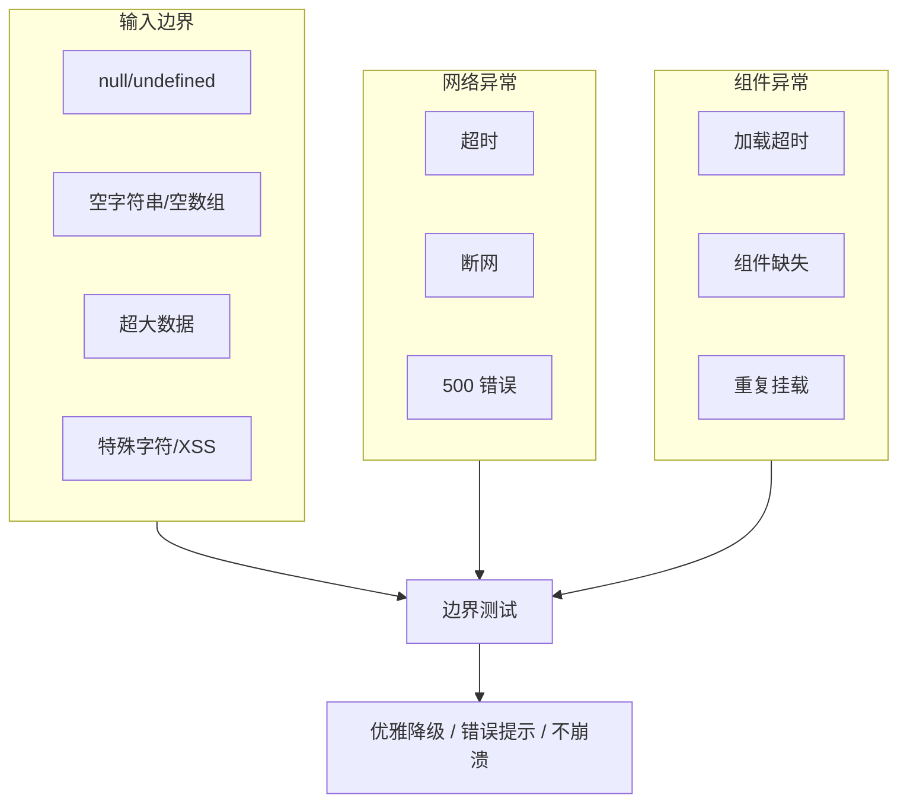

# 场景-4: 异常路径与边界测试

> **场景 ID**: yiweb-auto-test-suite-scene-4
> **关联 FP**: FP4
> **优先级**: P1

## §0 测试架构

### 测试目标

验证 YiWeb 在异常输入、边界条件、网络故障、组件加载失败等场景下的行为正确性。

### 架构图



### 测试策略

| 类别 | 测试类型 | Mock 策略 | 覆盖模块 |
|------|:-------:|----------|---------|
| 空值输入 | 单元 | 直接传参 | log.js, error.js, config.js |
| 网络异常 | 单元 | mock fetch reject | requestHelper.js |
| 组件异常 | 集成 | mock 超时/缺失 | baseView.js |
| XSS 防护 | 单元 | 直接输入 | escapeHtml, Markdown sanitize |
| 并发竞态 | 集成 | 并发请求 | crud.js |

### 覆盖率目标

- 异常路径分支覆盖率 ≥ 80%
- 边界条件用例数 ≥ 15

## §1 可执行测试用例

### 模块-1: 空值与边界输入

```javascript
// tests/scene-4-null-boundary.test.js
import { describe, it, expect, beforeEach, afterEach, vi } from 'vitest';

describe('空值与边界输入', () => {
  beforeEach(() => {
    window.__ENV__ = { DEBUG: true, name: 'test', isLocal: true };
    vi.spyOn(console, 'info').mockImplementation(() => {});
    vi.spyOn(console, 'error').mockImplementation(() => {});
  });

  afterEach(() => {
    vi.restoreAllMocks();
  });

  it('logInfo 接受 null 不抛出异常', async () => {
    const { logInfo } = await import('/cdn/utils/core/log.js');
    expect(() => logInfo(null)).not.toThrow();
  });

  it('logError 接受 undefined 不抛出异常', async () => {
    const { logError } = await import('/cdn/utils/core/log.js');
    expect(() => logError(undefined)).not.toThrow();
  });

  it('escapeHtml 处理空字符串返回空字符串', () => {
    const escapeHtml = (str) => {
      if (str == null) return '';
      const div = document.createElement('div');
      div.appendChild(document.createTextNode(String(str)));
      return div.innerHTML;
    };
    expect(escapeHtml('')).toBe('');
  });

  it('escapeHtml 处理 XSS 注入', () => {
    const escapeHtml = (str) => {
      if (str == null) return '';
      const div = document.createElement('div');
      div.appendChild(document.createTextNode(String(str)));
      return div.innerHTML;
    };
    const xss = '';
    const result = escapeHtml(xss);
    expect(result).not.toContain('onerror');
    expect(result).not.toContain(' {
    const { buildApiUrl } = await import('/src/core/config.js?' + Math.random());
    const url = buildApiUrl(null);
    expect(url).toContain('effiy.cn');
  });

  it('buildDataUrl 处理 undefined 返回 base URL', async () => {
    const { buildDataUrl } = await import('/src/core/config.js?' + Math.random());
    const url = buildDataUrl(undefined);
    expect(url).toContain('data.effiy.cn');
  });
});
```

### 模块-2: 网络异常处理

```javascript
// tests/scene-4-network-error.test.js
import { describe, it, expect, beforeEach, afterEach, vi } from 'vitest';

describe('网络异常处理', () => {
  beforeEach(() => {
    vi.stubGlobal('logInfo', vi.fn());
    vi.stubGlobal('logError', vi.fn());
    vi.stubGlobal('logWarn', vi.fn());
    vi.stubGlobal('timeStart', vi.fn());
    vi.stubGlobal('timeEnd', vi.fn());
  });

  afterEach(() => {
    vi.unstubAllGlobals();
  });

  it('getRequest 网络超时时抛出错误', async () => {
    vi.stubGlobal('fetch', vi.fn(() =>
      new Promise((_, reject) => setTimeout(() => reject(new Error('timeout')), 100))
    ));
    const { getRequest } = await import('/src/core/services/helper/requestHelper.js');
    await expect(getRequest('https://api.effiy.cn/timeout-test')).rejects.toThrow();
  });

  it('postRequest 服务器 500 时正常返回错误响应', async () => {
    vi.stubGlobal('fetch', vi.fn(() =>
      Promise.resolve({
        ok: false,
        status: 500,
        headers: new Map([['content-type', 'application/json']]),
        json: () => Promise.resolve({ code: -1, message: 'Internal Server Error' }),
      })
    ));
    const { postRequest } = await import('/src/core/services/helper/requestHelper.js');
    const result = await postRequest('https://api.effiy.cn/500-test', {});
    expect(result).toBeDefined();
    expect(result.code).toBe(-1);
  });

  it('retryRequest 超过最大重试次数后抛出错误', async () => {
    vi.stubGlobal('fetch', vi.fn(() => Promise.reject(new Error('持续失败'))));
    const { retryRequest } = await import('/src/core/services/helper/requestHelper.js');
    await expect(
      retryRequest('https://api.effiy.cn/fail-test', { retries: 2 })
    ).rejects.toThrow();
  });
});
```

### 模块-3: 组件加载异常

```javascript
// tests/scene-4-component-error.test.js
import { describe, it, expect, beforeEach, afterEach, vi } from 'vitest';

describe('组件加载异常', () => {
  beforeEach(() => {
    vi.stubGlobal('logInfo', vi.fn());
    vi.stubGlobal('logWarn', vi.fn());
    vi.stubGlobal('logError', vi.fn());

    vi.stubGlobal('Vue', {
      createApp: vi.fn(() => ({
        mount: vi.fn(() => ({})),
        component: vi.fn(),
        use: vi.fn(),
      })),
      ref: vi.fn((val) => ({ value: val, __v_isRef: true })),
      computed: vi.fn((fn) => ({ value: fn() })),
      isRef: vi.fn(() => false),
      provide: vi.fn(),
    });
    document.body.innerHTML = '<div id="app"><p>hello</p></div>';
  });

  afterEach(() => {
    vi.unstubAllGlobals();
    // Restore original document.body
    document.body.innerHTML = '';
  });

  it('createBaseView 挂载到不存在的选择器时抛出错误', async () => {
    document.body.innerHTML = '';
    const { createBaseView } = await import('/cdn/utils/view/baseView.js');
    await expect(
      createBaseView({
        createStore: () => ({}),
        useComputed: () => ({}),
        useMethods: () => ({}),
        selector: '#nonexistent',
      })
    ).rejects.toThrow();
  });

  it('waitForComponents 空数组直接 resolve', async () => {
    const { waitForComponents } = await import('/cdn/utils/view/baseView.js');
    await expect(waitForComponents([])).resolves.toBeUndefined();
  });

  it('waitForComponents 已就绪组件立即完成', async () => {
    window.TestComponent = { name: 'TestComponent' };
    const { waitForComponents } = await import('/cdn/utils/view/baseView.js');
    await expect(waitForComponents(['TestComponent'])).resolves.toBeUndefined();
    delete window.TestComponent;
  });
});
```

### 模块-4: 并发与竞态

```javascript
// tests/scene-4-concurrency.test.js
import { describe, it, expect, beforeEach, afterEach, vi } from 'vitest';

describe('并发与竞态', () => {
  beforeEach(() => {
    vi.stubGlobal('logInfo', vi.fn());
    vi.stubGlobal('logError', vi.fn());
    vi.stubGlobal('logWarn', vi.fn());
    vi.stubGlobal('timeStart', vi.fn());
    vi.stubGlobal('timeEnd', vi.fn());
  });

  afterEach(() => {
    vi.unstubAllGlobals();
  });

  it('batchRequests 并发发送多个请求', async () => {
    let callCount = 0;
    vi.stubGlobal('fetch', vi.fn(() => {
      callCount++;
      return Promise.resolve({
        ok: true, status: 200,
        headers: new Map([['content-type', 'application/json']]),
        json: () => Promise.resolve({ code: 0, data: { call: callCount } }),
      });
    }));
    const { batchRequests } = await import('/src/core/services/helper/requestHelper.js');
    const results = await batchRequests([
      { url: 'https://api.effiy.cn/batch-1' },
      { url: 'https://api.effiy.cn/batch-2' },
      { url: 'https://api.effiy.cn/batch-3' },
    ]);
    expect(results).toHaveLength(3);
    expect(callCount).toBe(3);
  });

  it('batchRequests 部分失败不影响其他请求', async () => {
    let callSeq = 0;
    vi.stubGlobal('fetch', vi.fn(() => {
      callSeq++;
      if (callSeq === 2) return Promise.reject(new Error('fail'));
      return Promise.resolve({
        ok: true, status: 200,
        headers: new Map([['content-type', 'application/json']]),
        json: () => Promise.resolve({ code: 0, data: { seq: callSeq } }),
      });
    }));
    const { batchRequests } = await import('/src/core/services/helper/requestHelper.js');
    // batchRequests should handle partial failures gracefully
    // Behavior depends on implementation - may reject entirely or return partial
    const results = await batchRequests([
      { url: 'https://api.effiy.cn/b-1' },
      { url: 'https://api.effiy.cn/b-2' },
      { url: 'https://api.effiy.cn/b-3' },
    ]).catch(() => []);
    // Test passes if it doesn't crash
    expect(Array.isArray(results)).toBe(true);
  });
});
```
