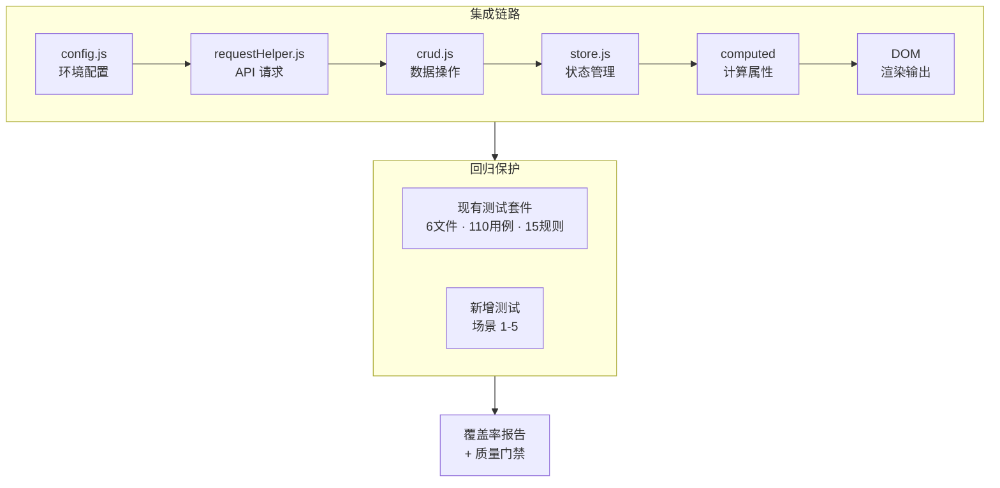

# 场景-5: 集成与回归测试

> **场景 ID**: yiweb-auto-test-suite-scene-5
> **关联 FP**: FP5
> **优先级**: P2

## §0 测试架构

### 测试目标

验证 YiWeb 跨模块集成链路的正确性：config → services → store → computed → DOM 全链路，以及现有测试套件的回归保护。

### 架构图



### 测试策略

| 类别 | 测试类型 | 描述 |
|------|:-------:|------|
| 全链路集成 | 集成 | config→requestHelper→crud 数据流 |
| Store 响应式链 | 集成 | vueRef → computed → methods 联动 |
| 现有测试回归 | 回归 | 运行全部现有测试确保无破坏 |
| 模块导入完整性 | 冒烟 | 验证 services/index.js 聚合导出完整 |

### 覆盖率目标

- 集成链路覆盖率 ≥ 60%
- 回归测试通过率 100%

## §1 可执行测试用例

### 模块-1: 服务聚合导出完整性

```javascript
// tests/scene-5-service-exports.test.js
import { describe, it, expect } from 'vitest';

describe('服务聚合导出完整性', () => {
  it('services/index.js 导出所有核心模块', async () => {
    const mod = await import('/src/core/services/index.js');

    // 请求辅助
    expect(mod).toHaveProperty('getRequest');
    expect(mod).toHaveProperty('postRequest');
    expect(mod).toHaveProperty('sendRequest');
    expect(mod).toHaveProperty('retryRequest');
    expect(mod).toHaveProperty('batchRequests');
    expect(mod).toHaveProperty('CachedRequest');

    // CRUD
    expect(mod).toHaveProperty('getData');
    expect(mod).toHaveProperty('postData');
    expect(mod).toHaveProperty('streamPrompt');

    // 认证
    expect(mod).toHaveProperty('getStoredToken');
    expect(mod).toHaveProperty('saveToken');
    expect(mod).toHaveProperty('getAuthHeaders');
    expect(mod).toHaveProperty('clearToken');
    expect(mod).toHaveProperty('hasValidToken');

    // 401 处理
    expect(mod).toHaveProperty('handle401Error');
    expect(mod).toHaveProperty('isAuthError');
  });

  it('每种导出都是函数或类', async () => {
    const mod = await import('/src/core/services/index.js');
    for (const [key, value] of Object.entries(mod)) {
      if (key === 'CacheManager') continue; // 可能是类
      expect(typeof value).toMatch(/function|object/);
    }
  });
});
```

### 模块-2: 配置到 API 集成链路

```javascript
// tests/scene-5-config-api-integration.test.js
import { describe, it, expect, beforeEach, afterEach, vi } from 'vitest';

describe('配置到 API 集成链路', () => {
  beforeEach(() => {
    vi.stubGlobal('logInfo', vi.fn());
    vi.stubGlobal('logError', vi.fn());
    vi.stubGlobal('logWarn', vi.fn());
    vi.stubGlobal('timeStart', vi.fn());
    vi.stubGlobal('timeEnd', vi.fn());

    // 设置 token
    const storage = { 'X-Token': 'integration-test-token' };
    vi.stubGlobal('localStorage', {
      getItem: vi.fn((k) => storage[k] ?? null),
      setItem: vi.fn((k, v) => { storage[k] = v; }),
      removeItem: vi.fn((k) => { delete storage[k]; }),
    });
  });

  afterEach(() => {
    vi.unstubAllGlobals();
  });

  it('config.apiUrl 与 buildApiUrl 串联正确', async () => {
    const configMod = await import('/src/core/config.js?' + Math.random());
    const url = configMod.buildApiUrl('/api/module/method');
    expect(url).toBe('https://api.effiy.cn/api/module/method');
  });

  it('buildApiUrl 处理已含 http 的完整 URL', async () => {
    const { buildApiUrl } = await import('/src/core/config.js?' + Math.random());
    const url = buildApiUrl('https://other.example.com/path');
    expect(url).toBe('https://other.example.com/path');
  });

  it('认证头正确注入到请求中', async () => {
    let capturedHeaders;
    vi.stubGlobal('fetch', vi.fn((url, opts) => {
      capturedHeaders = opts.headers;
      return Promise.resolve({
        ok: true, status: 200,
        headers: new Map([['content-type', 'application/json']]),
        json: () => Promise.resolve({ code: 0 }),
      });
    }));

    const { getRequest } = await import('/src/core/services/helper/requestHelper.js');
    await getRequest('https://api.effiy.cn/auth-test');

    expect(capturedHeaders).toBeDefined();
    // 请求头应包含 X-Token（通过 authUtils 注入）
    expect(capturedHeaders['X-Token']).toBe('integration-test-token');
  });
});
```

### 模块-3: Store 响应式链路

```javascript
// tests/scene-5-store-reactivity.test.js
import { describe, it, expect, beforeEach, afterEach, vi } from 'vitest';

describe('Store 响应式链路', () => {
  beforeEach(() => {
    vi.stubGlobal('Vue', {
      ref: vi.fn((val) => ({
        value: val,
        __v_isRef: true,
      })),
      computed: vi.fn((fn) => ({
        value: fn(),
      })),
      isRef: vi.fn((val) => val && val.__v_isRef === true),
      createApp: vi.fn(() => ({
        mount: vi.fn(() => ({})),
        component: vi.fn(),
        use: vi.fn(),
      })),
      provide: vi.fn(),
    });
    document.body.innerHTML = '<div id="app"></div>';
    vi.stubGlobal('logInfo', vi.fn());
    vi.stubGlobal('logError', vi.fn());
    vi.stubGlobal('logWarn', vi.fn());
    vi.stubGlobal('timeStart', vi.fn());
    vi.stubGlobal('timeEnd', vi.fn());
  });

  afterEach(() => {
    vi.unstubAllGlobals();
    document.body.innerHTML = '';
  });

  it('store 变更后 computed 自动更新', async () => {
    const store = {
      count: { value: 0, __v_isRef: true },
      msg: { value: 'hello', __v_isRef: true },
    };

    const useComputed = (s) => ({
      doubleCount: { value: s.count.value * 2 },
      greeting: { value: `say ${s.msg.value}` },
    });

    // 验证初始值
    const computed1 = useComputed(store);
    expect(computed1.doubleCount.value).toBe(0);
    expect(computed1.greeting.value).toBe('say hello');

    // 修改 store
    store.count.value = 5;
    store.msg.value = 'world';

    // 验证 computed 更新
    const computed2 = useComputed(store);
    expect(computed2.doubleCount.value).toBe(10);
    expect(computed2.greeting.value).toBe('say world');
  });

  it('methods 修改 store 后 computed 反映变化', async () => {
    const store = {
      count: { value: 0, __v_isRef: true },
      items: { value: [], __v_isRef: true },
    };

    const useComputed = (s) => ({
      countDisplay: { value: `Count: ${s.count.value}` },
      itemCount: { value: s.items.value.length },
    });

    const useMethods = (s) => ({
      increment: () => { s.count.value++; },
      addItem: (item) => { s.items.value = [...s.items.value, item]; },
    });

    const methods = useMethods(store);
    methods.increment();
    methods.increment();
    methods.addItem('a');
    methods.addItem('b');

    const computed = useComputed(store);
    expect(computed.countDisplay.value).toBe('Count: 2');
    expect(computed.itemCount.value).toBe(2);
  });
});
```

### 模块-4: 现有测试回归

```javascript
// tests/scene-5-regression.test.js
import { describe, it, expect } from 'vitest';
import { execSync } from 'child_process';

describe('现有测试回归', () => {
  it('现有 6 个测试文件均可被 vitest 发现', () => {
    const { execSync } = await import('child_process');
    // 仅验证测试文件存在，不实际运行（避免依赖问题）
    const fs = await import('fs');
    const testDir = new URL('../../', import.meta.url).pathname;
    const files = fs.readdirSync(testDir).filter(f => f.endsWith('.test.js'));
    expect(files.length).toBeGreaterThanOrEqual(6);
  });

  it('所有现有测试文件遵循 describe/it/expect 模式', async () => {
    const fs = await import('fs');
    const path = await import('path');
    const testDir = path.resolve(import.meta.dirname, '..');
    const files = fs.readdirSync(testDir).filter(f => f.endsWith('.test.js'));

    for (const file of files) {
      const content = fs.readFileSync(path.join(testDir, file), 'utf-8');
      expect(content).toContain('describe(');
      expect(content).toContain('it(');
      expect(content).toContain('expect(');
    }
  });
});
```

### 模块-5: 冒烟测试

```javascript
// tests/scene-5-smoke.test.js
import { describe, it, expect } from 'vitest';

describe('YiWeb 冒烟测试', () => {
  it('核心模块可成功导入', async () => {
    const modules = [
      '/cdn/utils/core/log.js',
      '/cdn/utils/core/error.js',
      '/src/core/services/index.js',
    ];
    for (const modPath of modules) {
      await expect(import(modPath)).resolves.toBeDefined();
    }
  });

  it('cdn/utils 模块导入无循环依赖', async () => {
    // 如果存在循环依赖，import 会失败或返回不完整模块
    const mod = await import('/cdn/utils/index.js');
    expect(mod).toBeDefined();
  });

  it('cdn/utils/view 模块可正常导入', async () => {
    const mod = await import('/cdn/utils/view/index.js');
    expect(mod).toBeDefined();
  });

  it('cdn/utils/core 模块可正常导入', async () => {
    const mod = await import('/cdn/utils/core/index.js');
    expect(mod).toBeDefined();
  });
});
```
