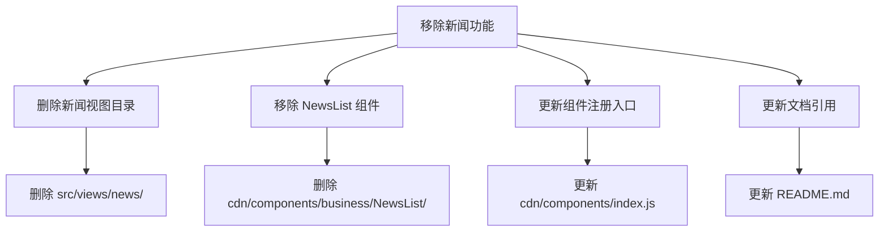
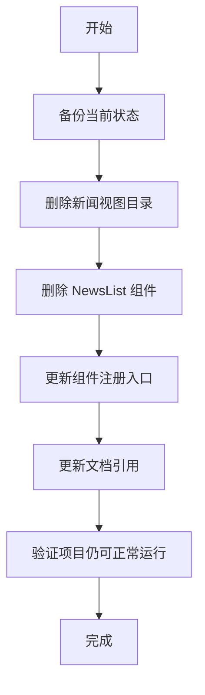
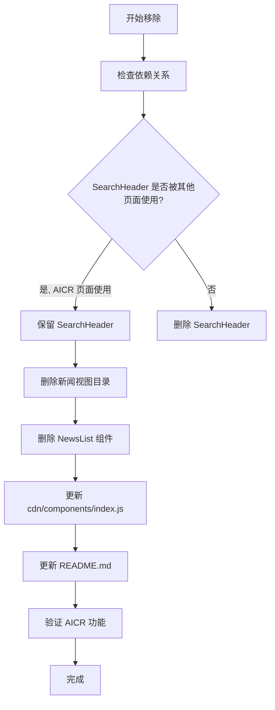
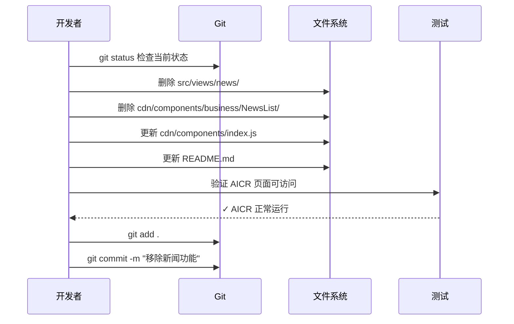

# 移除新闻功能

> **文档版本**: v1.0 | **最后更新**: 2026-04-28 | **维护者**: Claude Code | **工具**: Claude Code
>
> **关联文档**: [需求文档](../移除新闻功能/01_需求文档.md) | [设计文档](../移除新闻功能/03_设计文档.md) | [使用文档](../移除新闻功能/04_使用文档.md)
>

[功能概述](#功能概述) | [功能分析](#功能分析) | [功能详情](#功能详情) | [验收标准](#验收标准) | [使用场景示例](#使用场景示例)

---

## 功能概述

本任务的目标是从 YiWeb 项目中彻底移除所有与新闻相关的功能、页面和组件，简化项目结构，减少不必要的维护成本。移除范围包括新闻页面视图、NewsList 业务组件，以及引用这些组件的入口文件，同时保留仍在 AICR 页面中使用的 SearchHeader 组件。

🎯 **聚焦清理**：仅移除新闻功能相关代码
⚡ **简化结构**：减少代码库复杂度
📖 **完整清理**：移除所有相关文件，不留残留

## 功能分析

### 功能分解图

### 用户流程图

### 功能流程图

### 完整时序图

## 用户故事表格

| 用户故事 | 验收标准 | 过程生成文档 | 产出智能文档 |
|----------|----------|--------|----------|
| 🔴 **作为项目维护者，我希望移除新闻相关功能，以便简化项目结构和降低维护成本**  **主要操作场景**： - 删除新闻视图目录 - 移除 NewsList 业务组件 - 更新组件注册入口 - 更新文档引用 | 1. 新闻页面目录 `src/views/news/` 已完整删除 2. NewsList 业务组件已从 `cdn/components/business/` 中移除 3. `cdn/components/index.js` 已移除 NewsList 导出 4. `README.md` 已移除新闻应用相关描述 5. 项目仍可正常运行，不影响 AICR 等其他功能 | [移除新闻功能-清理新闻视图](../移除新闻功能/02_需求任务.md) | [生成文档 Skill](../../.claude/skills/generate-document/SKILL.md) [需求文档规范](../../.claude/skills/generate-document/rules/需求文档.md) |

## 主要操作场景定义

### 🎯 主要操作场景：删除新闻视图目录

**场景描述**：完整删除 `src/views/news/` 目录及其所有子文件，包括入口文件、组件、状态管理、样式等。

**前置条件**：
- Git 仓库已存在，当前状态可提交
- 已确认新闻功能不再使用

**操作步骤**：
1. 检查 `src/views/news/` 目录内容
2. 删除整个 `src/views/news/` 目录
3. 验证删除成功

**预期结果**：`src/views/news/` 目录及其所有文件已被删除。

**验证关注点**：
- 目录是否完整删除
- 是否有其他文件引用了该目录下的文件
- Git 状态是否正确记录删除操作

**相关设计文档章节**：[主要操作场景实现](../移除新闻功能/03_设计文档.md#主要操作场景实现)

### 🎯 主要操作场景：移除 NewsList 组件

**场景描述**：从 `cdn/components/business/` 中删除 NewsList 组件目录。

**前置条件**：
- 已确认 NewsList 组件仅被新闻页面使用
- SearchHeader 组件仍被 AICR 页面使用，需要保留

**操作步骤**：
1. 检查 `cdn/components/business/NewsList/` 目录内容
2. 删除整个 NewsList 组件目录
3. 保留 SearchHeader 组件

**预期结果**：NewsList 组件已删除，SearchHeader 组件保留。

**验证关注点**：
- NewsList 组件是否完整删除
- SearchHeader 组件是否保留
- 是否有其他文件引用了 NewsList 组件

**相关设计文档章节**：[主要操作场景实现](../移除新闻功能/03_设计文档.md#主要操作场景实现)

### 🎯 主要操作场景：更新组件注册入口

**场景描述**：更新 `cdn/components/index.js`，移除 NewsList 组件的导出语句，保留 SearchHeader 组件。

**前置条件**：
- NewsList 组件已删除
- 已确认 SearchHeader 仍被 AICR 页面使用

**操作步骤**：
1. 读取 `cdn/components/index.js` 文件
2. 移除 NewsList 相关的导入和导出语句
3. 保留 SearchHeader 相关语句
4. 保存文件

**预期结果**：`cdn/components/index.js` 已更新，只保留 SearchHeader 组件的导出。

**验证关注点**：
- NewsList 导出是否已移除
- SearchHeader 导出是否保留
- 文件语法是否正确

**相关设计文档章节**：[主要操作场景实现](../移除新闻功能/03_设计文档.md#主要操作场景实现)

### 🎯 主要操作场景：更新文档引用

**场景描述**：更新 README.md 等文档，移除新闻应用相关描述和链接。

**前置条件**：
- 代码变更已完成

**操作步骤**：
1. 读取 README.md 文件
2. 移除新闻应用相关的描述和链接
3. 保存文件

**预期结果**：README.md 已更新，不再包含新闻应用相关内容。

**验证关注点**：
- 新闻相关描述是否已移除
- 文档是否保持其他内容完整

**相关设计文档章节**：[主要操作场景实现](../移除新闻功能/03_设计文档.md#主要操作场景实现)

## 影响分析

> **强制执行**：已按照 `../../shared/document-contracts.md` 对整个项目执行完整影响分析。

### 执行步骤
1. **读取共享契约**：已读取 `../../shared/document-contracts.md`
2. **确定核心标识符**：从需求中提取核心标识符（news、NewsList、SearchHeader、src/views/news/）
3. **按契约全项目搜索**：对每个搜索词在整个仓库执行分类搜索
4. **追踪依赖链闭合**：检查每个命中点的上游依赖、调用方、导出方
5. **标注处置方式**：确定每个文件的处置方式

### 搜索词与改动点清单

| 改动点 | 类型 | 搜索词 | 来源 | 备注 |
|--------|------|--------|------|------|
| NewsList 组件 | component | `NewsList`, `news` | 需求文档 | 仅被新闻页面使用，可删除 |
| SearchHeader 组件 | component | `SearchHeader` | 需求文档 | AICR 页面也在使用，需要保留 |
| 新闻视图目录 | directory | `src/views/news/` | 需求文档 | 完整删除 |
| README.md | document | `新闻`, `News` | 需求文档 | 更新，移除新闻应用描述 |

### 改动点影响链

| 改动点 | 搜索词 | 命中文件 | 引用方式 | 影响层级 | 依赖方向 | 处置方式 | 闭合状态 | 说明 |
|--------|--------|----------|----------|---------|---------|---------|------|
| NewsList 组件 | `NewsList` | `cdn/components/index.js:28,57` | import/export | 直接 | 反向依赖 | 同步修改 | 已闭合 | 组件注册入口需要更新 |
| NewsList 组件 | `NewsList` | `src/views/news/index.js:20,30` | component usage | 直接 | 反向依赖 | 删除文件 | 已闭合 | 新闻页面使用，随新闻目录一起删除 |
| SearchHeader 组件 | `SearchHeader` | `cdn/components/index.js:27,55` | import/export | 直接 | 反向依赖 | 保持兼容 | 已闭合 | 保留，AICR 页面使用 |
| SearchHeader 组件 | `SearchHeader` | `src/views/aicr/index.js:37,59` | component usage | 直接 | 反向依赖 | 保持兼容 | 已闭合 | AICR 页面使用，必须保留 |
| SearchHeader 组件 | `SearchHeader` | `src/views/news/index.js:19,29` | component usage | 直接 | 反向依赖 | 删除文件 | 已闭合 | 随新闻目录一起删除 |
| 新闻视图目录 | `src/views/news/` | `README.md:27` | link | 直接 | 反向依赖 | 同步修改 | 已闭合 | README 中的链接需要移除 |
| 新闻视图目录 | `src/views/news/` | `docs/项目初始化/07_项目报告.md` | document reference | 二级 | 反向依赖 | 保持兼容 | 已闭合 | 历史文档，不影响代码运行 |

### 依赖闭合摘要

| 改动点 | 上游依赖是否核对 | 反向依赖是否核对 | 传递依赖是否闭合 | 测试/文档/配置是否覆盖 | 结论 |
|--------|------------------|------------------|------------------|------------------|------|
| NewsList 组件 | 是 | 是 | 是 | 是 | 可实施 |
| SearchHeader 组件 | 是 | 是 | 是 | 是 | 保留 |
| 新闻视图目录 | 是 | 是 | 是 | 是 | 可实施 |
| README.md | 是 | 是 | 是 | 是 | 可实施 |

### 未覆盖风险

| 风险来源 | 原因 | 影响 | 缓解方式 |
|----------|------|------|---------|
| docs/ 现有文档 | docs/ 目录下有一些历史文档引用了新闻功能 | 不影响代码运行，仅文档可能过时 | 文档引用可后续更新 |
| 其他可能的引用 | 可能有未搜索到的引用 | 低风险 | 执行后通过测试验证 |

### 改动范围汇总
- **需直接修改的文件数**：3个（删除 NewsList 组件目录、删除新闻视图目录、更新 cdn/components/index.js、更新 README.md）
- **需验证兼容性的文件数**：1个（SearchHeader 组件保留，验证 AICR 页面正常运行）
- **需追踪传递影响的文件数**：0个
- **需人工复核或阻断的风险**：低风险，执行后通过测试验证

## 功能详情

### 1. 新闻视图目录移除
**功能说明**：删除 `src/views/news/` 目录及其所有子文件，包括入口文件、组件、状态管理、样式等。
**价值**：移除核心新闻功能实现，减少代码库体积。
**解决痛点**：不再维护未使用的新闻功能代码。
**收益**：减少约 9 个文件的维护成本。

### 2. NewsList 业务组件移除
**功能说明**：从 `cdn/components/business/` 中删除 NewsList 组件目录。
**价值**：清理共享组件库中的业务组件，避免误引用。
**解决痛点**：减少共享组件库的维护负担。
**收益**：减少 4 个文件的维护成本。

### 3. 组件注册入口更新
**功能说明**：更新 `cdn/components/index.js`，移除 NewsList 组件的导出语句，保留 SearchHeader 组件。
**价值**：保持组件注册入口的准确性，避免加载不存在的组件。
**解决痛点**：防止引入不存在的组件导致的错误。

### 4. 文档引用更新
**功能说明**：更新 README.md 等文档，移除新闻应用相关描述和链接。
**价值**：保持文档与实际项目状态一致。
**解决痛点**：避免用户访问不存在的新闻功能页面。

## 验收标准

### P0 - 必须通过（需 100% 通过）
- [ ] 新闻页面目录 `src/views/news/` 完整删除
- [ ] NewsList 业务组件已从 `cdn/components/business/` 中移除
- [ ] `cdn/components/index.js` 已移除 NewsList 导出，保留 SearchHeader 导出
- [ ] `README.md` 已移除新闻应用相关描述
- [ ] 项目仍可正常访问 AICR 页面并使用其功能

### P1 - 应该通过
- [ ] SearchHeader 组件保留且可正常工作
- [ ] Git 历史清晰记录删除操作
- [ ] 无残留的新闻功能代码引用

### P2 - 可以有
- [ ] 更新变更日志
- [ ] 清理相关的历史文档引用

## 使用场景示例

### 📋 场景：执行完整移除流程
**背景**：项目维护者希望简化项目结构，移除不再使用的新闻功能。
**操作**：
1. 备份当前状态（git status, git stash 或 git commit）
2. 删除新闻视图目录
3. 删除 NewsList 组件
4. 更新组件注册入口
5. 更新文档引用
6. 验证 AICR 功能正常
**结果**：项目结构更简洁，AICR 功能正常运行。

### 🎨 场景：验证 AICR 功能未受影响
**背景**：移除操作完成后，需要验证其他功能不受影响。
**操作**：
1. 访问 AICR 页面
2. 测试核心功能（会话加载、文件树、聊天等）
3. 验证 SearchHeader 组件正常显示和工作
**结果**：AICR 功能完整，无任何异常。
