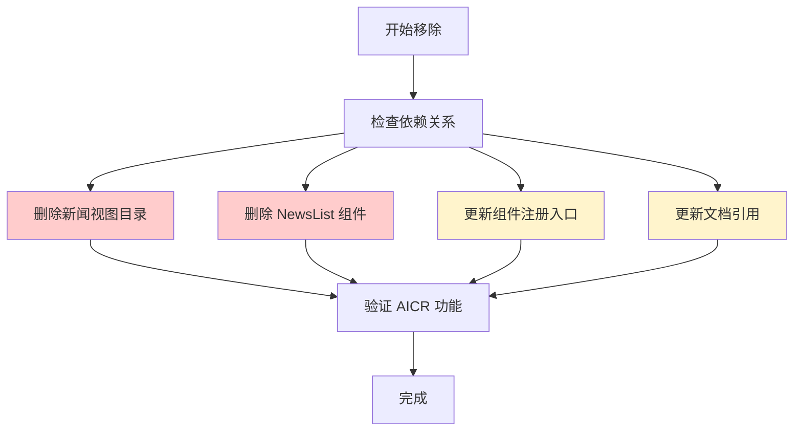
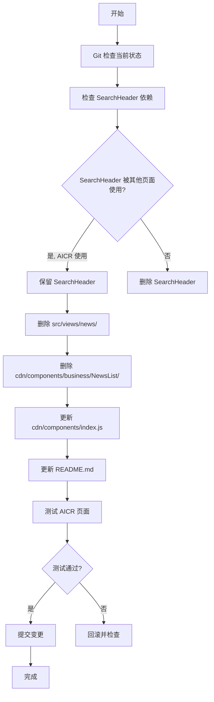
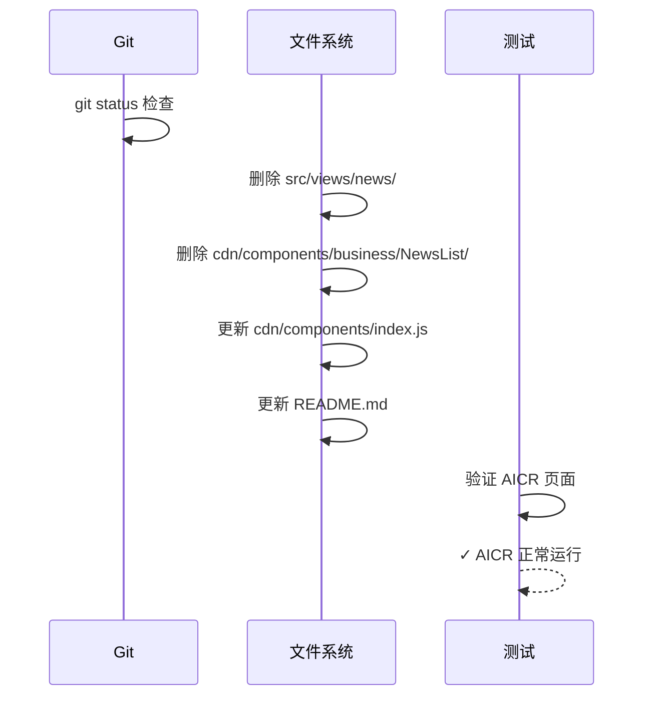

# 移除新闻功能设计

> **文档版本**: v1.0 | **最后更新**: 2026-04-28 | **维护者**: Claude Code | **工具**: Claude Code
>
> **关联文档**: [需求任务](../移除新闻功能/02_需求任务.md) | [使用文档](../移除新闻功能/04_使用文档.md) | [CLAUDE.md](../../CLAUDE.md)
>

[设计概述](#设计概述) | [架构设计](#架构设计) | [修复内容](#修复内容) | [影响分析](#影响分析) | [实现细节](#实现细节) | [主要操作场景实现](#主要操作场景实现) | [数据结构设计](#数据结构设计)

---

## 设计概述

本功能的设计目标是从 YiWeb 项目中彻底移除所有与新闻相关的功能、页面和组件，简化项目结构，减少不必要的维护成本。设计原则是安全移除，只删除明确不再使用的新闻功能相关代码，保留仍在 AICR 页面中使用的 SearchHeader 组件。

🎯 **安全移除**：只删除明确不再使用的代码
⚡ **最小影响**：确保不影响 AICR 等其他功能
🔧 **完整清理**：移除所有相关文件，不留残留

## 架构设计

### 整体架构



**说明**：整体架构展示了移除新闻功能的完整流程，包括检查依赖关系、删除文件、更新引用和验证功能。红色标记的是删除操作，黄色标记的是更新操作。

### 模块划分

| 模块名称 | 职责 | 文件位置 |
|----------|------|----------|
| 新闻视图目录 | 新闻页面主入口、组件、状态管理 | `src/views/news/`（删除） |
| NewsList 组件 | 新闻列表展示组件 | `cdn/components/business/NewsList/`（删除） |
| 组件注册入口 | 全局组件注册 | `cdn/components/index.js`（更新） |
| 项目文档 | 项目说明文档 | `README.md`（更新） |

### 核心流程图



**说明**：核心流程图展示了从开始到完成的完整执行路径，包括依赖检查、文件操作、测试验证等步骤。

## 修复内容

### 问题分析

**问题**：项目包含不再使用的新闻功能代码，增加了维护成本和代码库复杂度。

**影响范围**：
- `src/views/news/` 目录（约 9 个文件）
- `cdn/components/business/NewsList/` 目录（约 4 个文件）
- `cdn/components/index.js` 中的 NewsList 导出
- `README.md` 中的新闻应用描述

**原因**：新闻功能已不再使用，但代码仍保留在仓库中。

### 修复方案

**整体思路**：安全删除不再使用的新闻功能代码，保留仍在使用的 SearchHeader 组件。

**需要修改的文件清单**：
1. 删除：`src/views/news/` 目录及其所有文件
2. 删除：`cdn/components/business/NewsList/` 目录及其所有文件
3. 更新：`cdn/components/index.js` - 移除 NewsList 导出
4. 更新：`README.md` - 移除新闻应用相关描述

**每个修改文件的说明**：

| 文件路径 | 修改类型 | 说明 |
|---------|---------|------|
| `src/views/news/` | 删除 | 完整删除新闻视图目录 |
| `cdn/components/business/NewsList/` | 删除 | 完整删除 NewsList 组件目录 |
| `cdn/components/index.js` | 更新 | 移除 NewsList 的导入和导出，保留 SearchHeader |
| `README.md` | 更新 | 移除新闻应用相关描述和链接 |

### 修复前后对比

| 内容项 | 修复前 | 修复后 | 说明 |
|--------|--------|--------|------|
| 新闻视图目录 | 存在 `src/views/news/` | 不存在 | 完整删除 |
| NewsList 组件 | 存在 `cdn/components/business/NewsList/` | 不存在 | 完整删除 |
| SearchHeader 组件 | 存在 | 存在 | 保留，AICR 页面使用 |
| 组件注册 | 包含 NewsList 和 SearchHeader | 仅包含 SearchHeader | 移除 NewsList |
| README | 包含新闻应用描述 | 不包含 | 移除相关描述 |

```diff
--- a/cdn/components/index.js
+++ b/cdn/components/index.js
@@ -24,7 +24,6 @@
 // Business Components
 export { default as SkeletonLoader } from './business/SkeletonLoader/index.js';
 export { default as SearchHeader } from './business/SearchHeader/index.js';
-export { default as NewsList } from './business/NewsList/index.js';
 export { default as MarkdownView } from './business/MarkdownView/index.js';
 
 // Default export - object with all components
@@ -52,6 +51,5 @@
   YiDropdown,
   YiPagination,
   SearchHeader,
   SkeletonLoader,
-  NewsList,
   MarkdownView
```

```diff
--- a/README.md
+++ b/README.md
@@ -7,7 +7,6 @@
 
 ## 核心特性
 
-🤖 **AICR 应用** - 带 AI 聊天功能的代码审查界面
-📰 **新闻应用** - RSS 新闻阅读器
+🤖 **AICR 应用** - 带 AI 聊天功能的代码审查界面
 📦 **CDN 组件库** - 可复用 UI 组件、Markdown/Mermaid 渲染
 🛠️ **技能系统** - Claude Code 开发规范和文档生成工具
 
@@ -24,10 +22,6 @@
 
 **访问应用**：
 - AICR: `http://localhost:8000/src/views/aicr/index.html`
-- News: `http://localhost:8000/src/views/news/index.html`
```

## 影响分析

> **强制执行**：已按照 `../../shared/document-contracts.md` 对整个项目执行完整影响分析。

### 执行步骤
1. **读取共享契约**：已读取 `../../shared/document-contracts.md`
2. **确定核心标识符**：从需求任务中提取核心标识符
3. **按契约全项目搜索**：对每个搜索词在整个仓库执行分类搜索
4. **追踪依赖链闭合**：检查每个命中点的上游依赖、调用方、导出方
5. **标注处置方式**：确定每个文件的处置方式

### 搜索词与改动点清单

| 改动点 | 类型 | 搜索词 | 来源 | 备注 |
|--------|------|--------|------|------|
| NewsList 组件 | component | `NewsList`, `news` | 需求任务 | 仅被新闻页面使用，可删除 |
| SearchHeader 组件 | component | `SearchHeader` | 需求任务 | AICR 页面也在使用，需要保留 |
| 新闻视图目录 | directory | `src/views/news/` | 需求任务 | 完整删除 |
| README.md | document | `新闻`, `News` | 需求任务 | 更新，移除新闻应用描述 |

### 改动点影响链

| 改动点 | 搜索词 | 命中文件 | 引用方式 | 影响层级 | 依赖方向 | 处置方式 | 闭合状态 | 说明 |
|--------|--------|----------|----------|---------|---------|---------|------|
| NewsList 组件 | `NewsList` | `cdn/components/index.js:28,57` | import/export | 直接 | 反向依赖 | 同步修改 | 已闭合 | 组件注册入口需要更新 |
| NewsList 组件 | `NewsList` | `src/views/news/index.js:20,30` | component usage | 直接 | 反向依赖 | 删除文件 | 已闭合 | 新闻页面使用，随新闻目录一起删除 |
| SearchHeader 组件 | `SearchHeader` | `cdn/components/index.js:27,55` | import/export | 直接 | 反向依赖 | 保持兼容 | 已闭合 | 保留，AICR 页面使用 |
| SearchHeader 组件 | `SearchHeader` | `src/views/aicr/index.js:37,59` | component usage | 直接 | 反向依赖 | 保持兼容 | 已闭合 | AICR 页面使用，必须保留 |
| SearchHeader 组件 | `SearchHeader` | `src/views/news/index.js:19,29` | component usage | 直接 | 反向依赖 | 删除文件 | 已闭合 | 随新闻目录一起删除 |
| 新闻视图目录 | `src/views/news/` | `README.md:27` | link | 直接 | 反向依赖 | 同步修改 | 已闭合 | README 中的链接需要移除 |
| 新闻视图目录 | `src/views/news/` | `docs/项目初始化/07_项目报告.md` | document reference | 二级 | 反向依赖 | 保持兼容 | 已闭合 | 历史文档，不影响代码运行 |

### 依赖闭合摘要

| 改动点 | 上游依赖是否核对 | 反向依赖是否核对 | 传递依赖是否闭合 | 测试/文档/配置是否覆盖 | 结论 |
|--------|------------------|------------------|------------------|------------------|------|
| NewsList 组件 | 是 | 是 | 是 | 是 | 可实施 |
| SearchHeader 组件 | 是 | 是 | 是 | 是 | 保留 |
| 新闻视图目录 | 是 | 是 | 是 | 是 | 可实施 |
| README.md | 是 | 是 | 是 | 是 | 可实施 |

### 未覆盖风险

| 风险来源 | 原因 | 影响 | 缓解方式 |
|----------|------|------|---------|
| docs/ 现有文档 | docs/ 目录下有一些历史文档引用了新闻功能 | 不影响代码运行，仅文档可能过时 | 文档引用可后续更新 |
| 其他可能的引用 | 可能有未搜索到的引用 | 低风险 | 执行后通过测试验证 |

### 改动范围汇总
- **需直接修改的文件数**：4个（删除 NewsList 组件目录、删除新闻视图目录、更新 cdn/components/index.js、更新 README.md）
- **需验证兼容性的文件数**：1个（SearchHeader 组件保留，验证 AICR 页面正常运行）
- **需追踪传递影响的文件数**：0个
- **需人工复核或阻断的风险**：低风险，执行后通过测试验证

## 实现细节

### 技术实现要点

1. **依赖关系确认**：
   - 确认 SearchHeader 组件在 AICR 页面中被使用（`src/views/aicr/index.js:37,59`）
   - 确认 NewsList 组件仅在新闻页面中使用
   - 确认新闻视图目录无其他外部依赖

2. **文件删除策略**：
   - 完整删除目录，而非逐个文件
   - 通过 Git 记录删除操作，便于回滚

3. **组件注册更新**：
   - 只移除 NewsList 相关的导入和导出
   - 保留 SearchHeader 完整
   - 保持文件格式和其他内容不变

4. **文档更新策略**：
   - 移除新闻应用相关描述
   - 保留其他内容完整
   - 保持文档格式一致

### 关键代码说明

**关键文件路径**：
- `/var/www/YiWeb/src/views/news/` - 新闻视图目录（删除）
- `/var/www/YiWeb/cdn/components/business/NewsList/` - NewsList 组件（删除）
- `/var/www/YiWeb/cdn/components/index.js` - 组件注册入口（更新）
- `/var/www/YiWeb/README.md` - 项目文档（更新）

**关键变更**：
- `cdn/components/index.js` - 移除第 28 行和第 57 行的 NewsList 相关代码
- `README.md` - 移除新闻应用描述和链接

### 依赖关系

**删除的依赖**：
- NewsList 组件及其所有依赖
- 新闻视图目录及其所有依赖

**保留的依赖**：
- SearchHeader 组件（AICR 页面使用）
- 其他所有现有依赖

**外部依赖**：无新增或删除外部依赖

### 测试考虑

**测试用例建议**：
1. **删除验证**：验证新闻视图目录和 NewsList 组件已被删除
2. **组件注册验证**：验证 cdn/components/index.js 已正确更新
3. **AICR 功能验证**：验证 AICR 页面可正常访问和使用
4. **SearchHeader 验证**：验证 SearchHeader 组件在 AICR 页面中正常工作

**验证方式**：
- 手动浏览器验证 AICR 页面
- 文件系统检查删除结果
- Git 状态检查变更

## 主要操作场景实现

### 场景实现：删除新闻视图目录

**关联需求任务场景**：[主要操作场景：删除新闻视图目录](../移除新闻功能/02_需求任务.md#主要操作场景定义)

**实现概述**：完整删除 `src/views/news/` 目录及其所有子文件，包括入口文件、组件、状态管理、样式等。

**涉及模块**：
- `src/views/news/` - 新闻视图目录

**关键代码路径**：
- `src/views/news/index.js` - 新闻页面入口
- `src/views/news/index.html` - 新闻页面 HTML
- `src/views/news/hooks/` - 状态管理
- `src/views/news/components/` - 页面组件
- `src/views/news/styles/` - 页面样式

**验证关注点**：
- 目录是否完整删除
- Git 状态是否正确记录删除操作

### 场景实现：移除 NewsList 组件

**关联需求任务场景**：[主要操作场景：移除 NewsList 组件](../移除新闻功能/02_需求任务.md#主要操作场景定义)

**实现概述**：从 `cdn/components/business/` 中删除 NewsList 组件目录，保留 SearchHeader 组件。

**涉及模块**：
- `cdn/components/business/NewsList/` - NewsList 组件目录

**关键代码路径**：
- `cdn/components/business/NewsList/index.js` - NewsList 组件定义
- `cdn/components/business/NewsList/index.css` - NewsList 组件样式
- `cdn/components/business/NewsList/template.html` - NewsList 组件模板

**验证关注点**：
- NewsList 组件是否完整删除
- SearchHeader 组件是否保留

### 场景实现：更新组件注册入口

**关联需求任务场景**：[主要操作场景：更新组件注册入口](../移除新闻功能/02_需求任务.md#主要操作场景定义)

**实现概述**：更新 `cdn/components/index.js`，移除 NewsList 组件的导入和导出语句，保留 SearchHeader 组件。

**涉及模块**：
- `cdn/components/index.js` - 组件注册入口

**关键代码路径**：
- `cdn/components/index.js:28` - NewsList 导入语句（删除）
- `cdn/components/index.js:57` - NewsList 导出语句（删除）

**验证关注点**：
- NewsList 导出是否已移除
- SearchHeader 导出是否保留
- 文件语法是否正确

### 场景实现：更新文档引用

**关联需求任务场景**：[主要操作场景：更新文档引用](../移除新闻功能/02_需求任务.md#主要操作场景定义)

**实现概述**：更新 README.md 等文档，移除新闻应用相关描述和链接。

**涉及模块**：
- `README.md` - 项目说明文档

**关键代码路径**：
- `README.md:8` - 新闻应用特性描述（删除）
- `README.md:27` - 新闻应用链接（删除）

**验证关注点**：
- 新闻相关描述是否已移除
- 文档是否保持其他内容完整

## 数据结构设计

> 待补充（原因：本功能主要是代码删除，无新增数据结构设计）

### 数据流程图



**说明**：数据流程图展示了从检查状态到验证完成的完整执行流程。
